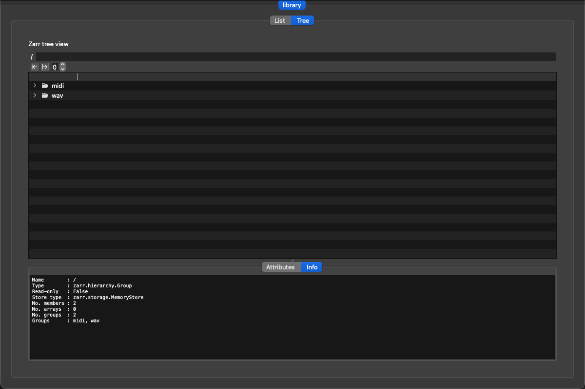
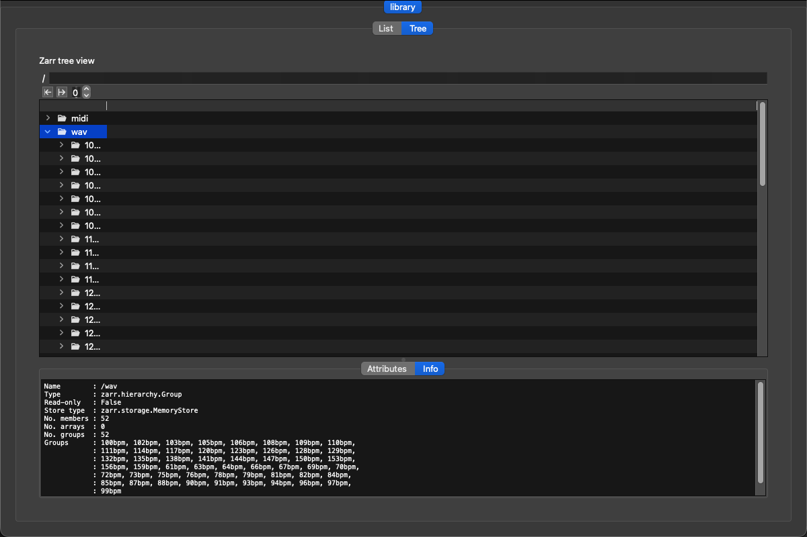

# Birka

Birka is a fast, media‑focused file manager for **audio and MIDI** libraries. It aims to make large sample collections easy to search, preview, tag, and organize — without opening a DAW.

## Screenshots
**List view**


**Tree view**


## Highlights
- **Audio + MIDI focused**: metadata (BPM, key, duration), tags, ratings.
- **Fast search** across name, BPM, key, tags.
- **BPM range + key filters**.
- **Waveform preview** for WAV files.
- **MIDI playback** via FluidSynth/Timidity (best‑effort).
- **Batch rename** with templates.
- **Physical sort** into `data/<type>/<bpm>/` folders.
- **Tree view** using `zarr-view` for hierarchical exploration.

## Quick Start

### 1) Create venv and install deps
```bash
cd /Volumes/External/Code/Birka
uv venv .venv
source .venv/bin/activate
uv pip install PyQt6
uv pip install zarr<3 qtawesome
```

### 2) (Optional) MIDI soundfont
Place a `.sf2` file here:
```
/Volumes/External/Code/Birka/data/FluidR3 GM.sf2
```
Or provide:
```bash
export BIRKA_SOUNDFONT="/path/to/FluidR3_GM.sf2"
```

### 3) Run the app
```bash
bash /Volumes/External/Code/Birka/restarter.sh
```

## Tests
```bash
bash /Volumes/External/Code/Birka/run_tests.sh
```

## Folder Structure
```
Birka/
├─ src/birka/
│  ├─ domain/          # Entities & value objects
│  ├─ application/     # Use cases & ports
│  ├─ infrastructure/  # IO adapters
│  └─ presentation/    # PyQt UI
├─ data/               # Test library + optional soundfont
├─ modules/            # External submodules (zarr-view)
└─ tests/
```

## Features in the UI
- **Search**: global text filter
- **BPM range filter**: min/max
- **Key filter**: e.g., `C#m`
- **Tags/Rating**: apply to selected rows
- **Batch rename**: template like `[BPM]_[Key]_[OriginalName]`
- **Sort files**: moves to `data/<type>/<bpm>/`
- **Delete selected**
- **Tree tab**: zarr‑view hierarchy + attrs

## MIDI Playback Notes
- Requires `fluidsynth` or `timidity`.
- On macOS, `fluidsynth` uses CoreAudio.
- If no soundfont is found, MIDI playback is disabled.

## Submodule
This project uses `zarr-view` as a submodule:
```bash
git submodule update --init --recursive
```

## License
This repository is for internal/prototype use. Add your license here.
